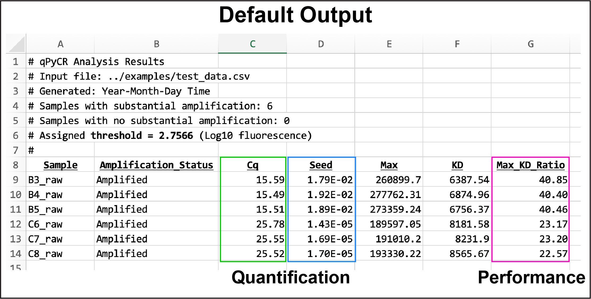
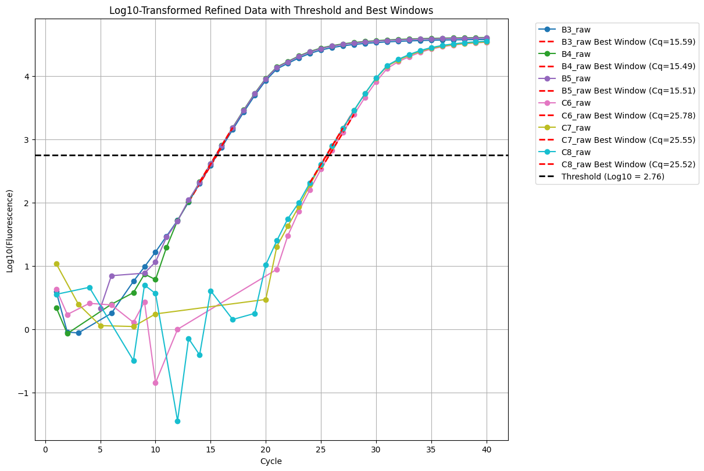
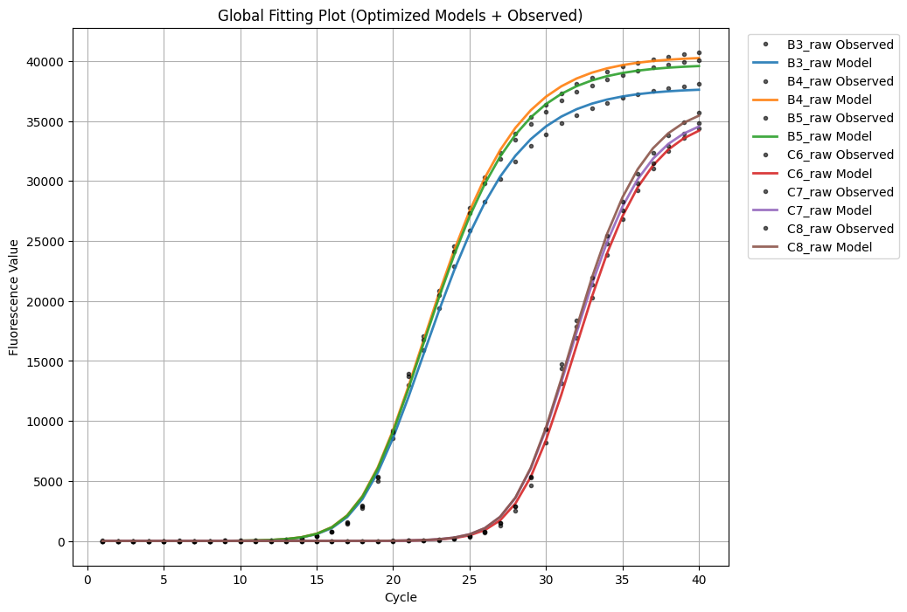

# qPyCR

[](https://mybinder.org/v2/gh/sdmoore-labs/qPyCR/HEAD?labpath=notebooks%2FqPyCR_v_current.ipynb)

qPyCR is a notebook‑first qPCR analysis workflow that implements global data fitting using a recursive PCR model.  
It accepts raw, unadjusted CSV data and produces Cq, Seed, Max, KD, and Max/KD outputs.

### Example Outputs

<p align="center">
  
</p>

<br>

<p align="center">
  
  
</p>


## Recommended Use

This project is designed to run as a Jupyter notebook. Choose one:

**Option 1: Binder (no install)**  
Click the badge above to launch the notebook in your browser — no setup required.  
Use `../examples/test_data.csv` as the input path. Outputs are saved to `notebooks/outputs/` — download before closing the session.

**Option 2: Google Colab**  
Upload the notebook from `notebooks/` to [Google Colab](https://colab.research.google.com/).

**Option 3: Local Jupyter**  
Clone the repo and run `pip install -r requirements.txt`, then open the notebook in `notebooks/`.

### Running the Analysis
1. Run cells in order (Cell‑0 → Cell‑11).
2. Use `-e` for evaluation outputs or `-d` for full debug outputs.
3. In some environments, 'Run All' may hang after providing input selections; you can click 'Run' repeatedly to step through the remaining cells.

## Inputs
CSV format with a `Cycle` column and one or more sample columns containing qPCR data for each cycle.

## Outputs
Cell‑11 generates the final report:
- `*_qPCR_Analysis_Outputs_*.csv`

Evaluation/Debug modes add intermediate CSVs and plots in `outputs/`.

## Folder Structure
```
qPyCR/
├── notebooks/      # Jupyter notebooks (run these)
├── cells/          # Individual cell scripts (for inspection/modification)
├── examples/       # Example datasets
├── images/         # Images for Readme
└── requirements.txt
```

## Scientific Background
This software implements and extends the use of the recursive PCR model described in:

> Carr AC, Moore SD (2012) Robust quantification of polymerase chain reactions using global fitting.  
> PLoS ONE 7(5): e37640. https://doi.org/10.1371/journal.pone.0037640

Is also generates the max/KD ratio for reaction performance evaluation described in:

> Moore SD (2025) Thermal-bias PCR: generation of amplicon libraries without degenerate primer interference.
> Peer J. Oct 24:13:e20241. doi: 10.7717/peerj.20241.

## Citation
Manuscript pending. If you use this software, please cite this repository for now:

- qPyCR (repository): https://github.com/sdmoore-labs/qpycr

We will update this section with the formal paper citation once available.

## License
MIT (see `LICENSE`).
